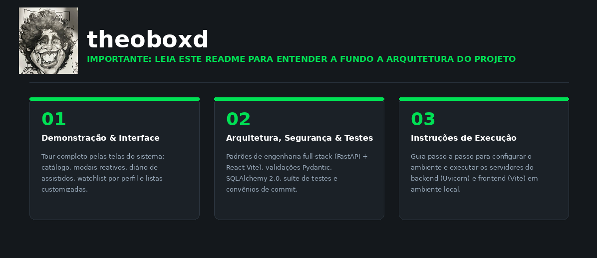
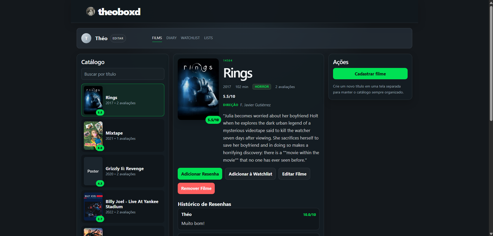
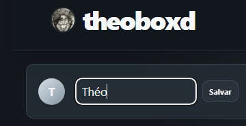
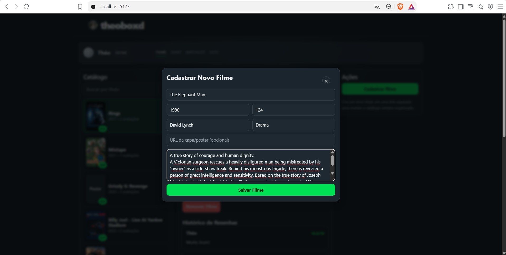
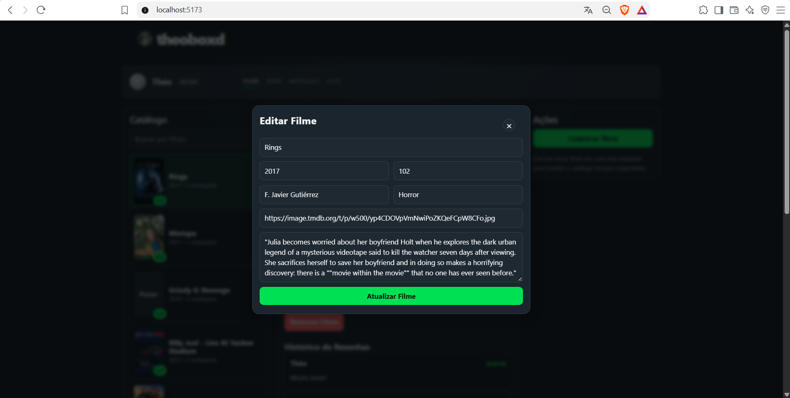
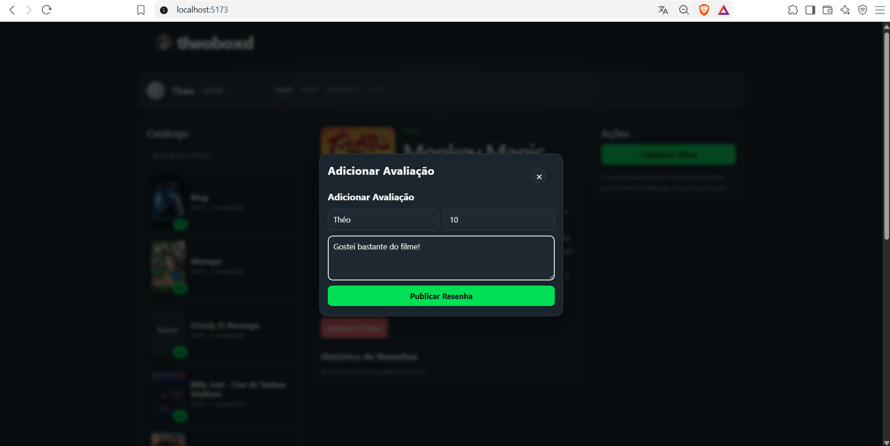
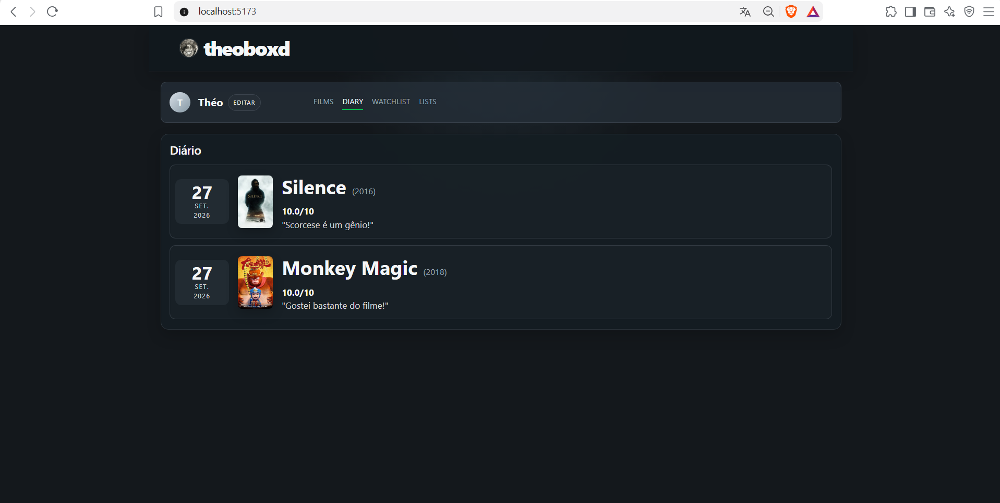
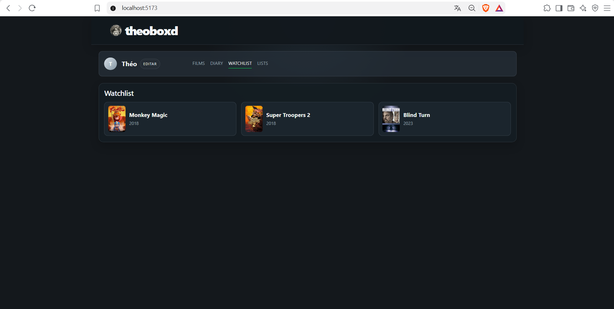
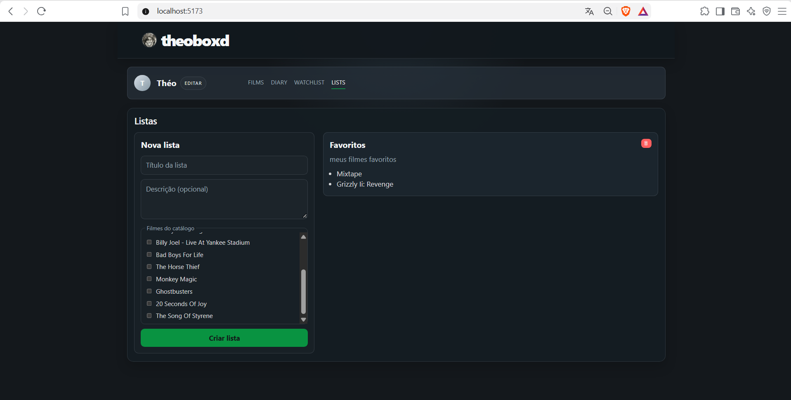

O **Theoboxd** é uma plataforma full-stack inspirada no ecossistema do Letterboxd, projetada para a gestão de catálogos cinematográficos, registo de resenhas e acompanhamento de atividades personalizadas. O projeto aplica arquitetura assíncrona no backend com FastAPI e uma interface reativa moderna construída em React, Vite e TypeScript.

---

## Demonstração da Aplicação

### Visualização do Catálogo e Detalhes do Filme

A interface principal combina a navegação fluida pelo catálogo com a visualização detalhada do filme selecionado, histórico de resenhas e ações rápidas.



---

### Edição de Perfil e Associação de Dados

A Watchlist, o Diário de assistidos e as Listas personalizadas são dinamicamente associados ao nome de utilizador ativo. A alteração do nome de perfil persiste os dados no ecossistema local do utilizador.



---

### Modais para Criação e Edição de Conteúdo

Fluxos de cadastro de filmes e submissão de avaliações são geridos por interfaces modais focadas na experiência do utilizador.

#### Cadastrar Novo Filme



#### Editar Filme Existente



#### Adicionar Resenha com Nota Numérica



---

### Secções de Diário, Watchlist e Listas Personalizadas

#### Diário (Timeline Cronológica de Resenhas)



#### Watchlist Personalizada por Perfil



#### Gestão e Exclusão de Listas Personalizadas



---

## Diferenciais Técnicos e Arquitetura

### Arquitetura de Código e Organização

A estrutura do projeto adota uma separação clara de responsabilidades entre backend e frontend. No frontend, foi aplicado o **Page-Component Pattern**, onde cada funcionalidade ou tela possui seus componentes, estilos e suítes de teste co-localizados no mesmo módulo, facilitando a manutenibilidade, o isolamento visual e a reutilização.

```text
Sistema-de-Avaliacao-de-Filmes/
├── backend/
│   ├── app/
│   │   ├── api/          # Endpoints REST segregados por versão (v1)
│   │   ├── core/         # Configurações globais e inicialização de BD
│   │   ├── models/       # Entidades SQLAlchemy (Movie, Review)
│   │   ├── schemas/      # Validações estritas Pydantic
│   │   └── main.py       # Ponto de entrada FastAPI e middlewares CORS
│   └── tests/            # Testes integrados com Pytest e TestClient
└── frontend/
    ├── src/
    │   ├── components/   # Componentes modulares organizados por visão (movies, profile, reviews, ui)
    │   ├── hooks/        # Custom hooks para encapsular chamadas de API e estado
    │   ├── services/     # Cliente HTTP (Axios)
    │   ├── test/         # Setup de testes unitários do Vitest
    │   └── types/        # Definições globais de interfaces TypeScript
    └── vite.config.ts    # Configurações do bundler e ambiente de teste

```

---

### Padrão de Commits

O repositório segue a especificação **Conventional Commits** para manter o histórico de alterações legível e auditável:

* `feat:` Novas funcionalidades (ex: `feat: adiciona opcao de exclusao de listas personalizadas`).
* `fix:` Correções de bugs (ex: `fix: corrige exportacao default no modulo principal`).
* `style:` Alterações de formatação ou ajustes visuais de CSS sem impacto em lógica.
* `test:` Adição ou ajuste de suítes de teste (ex: `test: adiciona testes unitarios com Vitest`).
* `refactor:` Refatorações de código sem alteração de comportamento.
* `docs:` Alterações puramente voltadas à documentação e arquivos do README (ex: `docs: adiciona capturas de tela e guia de execucao`).

---

### Segurança e Robustez no Backend

1. **CORS Restrito:** Middlewares configurados no FastAPI para limitar as origens permitidas em requisições cross-origin.
2. **Validação de Schemas Pydantic:** Todas as rotas de entrada (`POST`, `PUT`) higienizam o payload, prevenindo injeções de dados maliciosos.
3. **Mapeamento ORM Seguro:** SQLAlchemy 2.0 utilizado para parametrizar todas as consultas SQL automaticamente.
4. **Resolução de Erros Limpa:** Tratamento centralizado de exceções para evitar a exposição de detalhes internos do banco de dados ao cliente.

---

### Suíte de Testes Automatizados

O projeto conta com cobertura automatizada em ambas as camadas:

* **Backend:** Testes funcionais com `pytest` e `httpx`/`TestClient` para validação dos códigos de status HTTP e validação de parâmetros.
* **Frontend:** Testes unitários de componentes executados via `Vitest` e `React Testing Library`.

---

## Instruções de Execução

### Pré-requisitos

* Python 3.10+ instalado
* Node.js 18+ e npm instalados

---

### 1. Configurar e Subir o Backend (FastAPI)

Navegue até à pasta do backend, crie o ambiente virtual e instale as dependências:

```powershell
cd backend
python -m venv .venv

# Ativação no Windows (PowerShell)
.\.venv\Scripts\Activate.ps1

# Ativação no Linux/macOS
# source .venv/bin/activate

pip install -r requirements.txt

```

---

### 2. Popular o Banco de Dados (Carga Inicial / Seed)

Antes de iniciar a API pela primeira vez, execute o script de ingestão para carregar os filmes, metadados (diretor, gênero), pessoas e resenhas do dataset para o banco local:

```powershell
python -m app.db.seed

```

Após concluir a carga, inicie o servidor de desenvolvimento:

```powershell
uvicorn app.main:app --reload

```

O servidor backend estará disponível em `http://localhost:8000` (documentação Swagger ativa em `/docs`).

---

### 3. Configurar e Subir o Frontend (React / Vite)

Em um novo terminal, navegue até à pasta do frontend, instale as dependências e inicie o servidor:

```powershell
cd frontend
npm install
npm run dev

```

A aplicação web estará disponível em `http://localhost:5173`.

---

### 4. Executar as Suítes de Testes

#### Testes do Backend (Pytest)

No terminal da pasta `backend` com o `.venv` ativo:

```powershell
pytest

```

#### Testes do Frontend (Vitest)

No terminal da pasta `frontend`:

```powershell
npx vitest run

```
